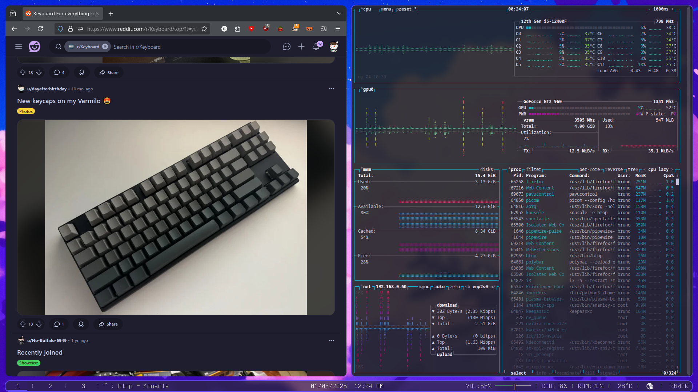
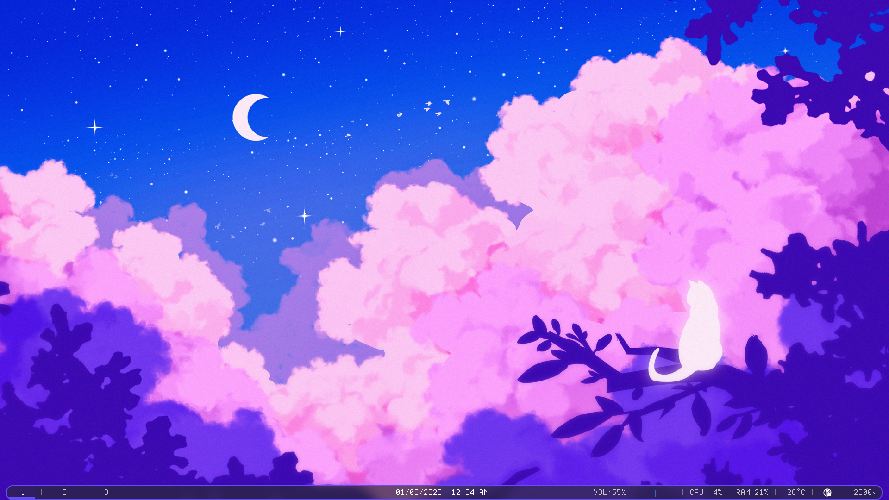
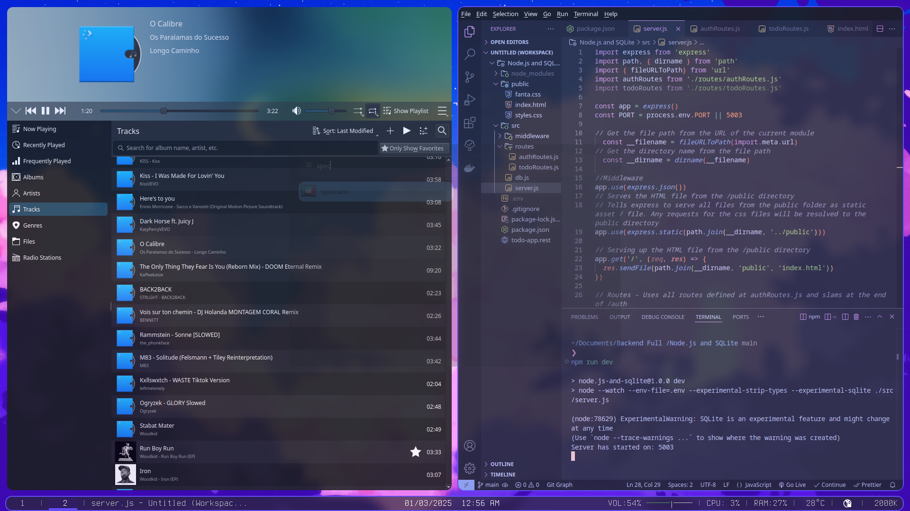

# Dotfiles

Hey! Here are my dotfiles for anyone interested. 😄








## Dependencies ⚙️

You'll need:

- **x11-xserver-utils**: For X11 server management. 🖥️
- **nitrogen**: Wallpaper manager. 🖼️
- **i3**: Tiling window manager. 🖱️
- **picom**: Compositor for effects like transparency and shadows. 🌘
- **polybar**: Status bar for i3. 📊
- **kitty**: GPU-based terminal emulator. 💻
- **rofi**: Window switcher and app launcher. 🔍
- **i3status**: Status bar generator for i3. 📈

## Setup 🛠️

1. **Clone the Repo**:

   ```bash
   git clone https://github.com/yourusername/dotfiles.git ~/.dotfiles
   ```

2. **Copy Configuration Files**:

   Manually copy the configuration files to their respective locations:

   - **i3**: Copy the files in `~/.dotfiles/i3` to `~/.config/i3/`
   - **Polybar**: Copy the files in `~/.dotfiles/polybar` to `~/.config/polybar/`
   - **Picom**: Copy the files in `~/.dotfiles/picom` to `~/.config/picom/`
   - **Kitty**: Copy the files in `~/.dotfiles/kitty` to `~/.config/kitty/`
   - **Rofi**: Copy the files in `~/.dotfiles/rofi` to `~/.config/rofi/`
   - **i3status**: Copy the files in `~/.dotfiles/i3status` to `~/.config/i3status/`

This will set up all your configuration files manually. 🔧

For more details, check out the [i3wm and Polybar setup guide](https://peerlator.netlify.app/posts/old-dotfiles-part-3/). 📚

Happy ricing! 🚀
